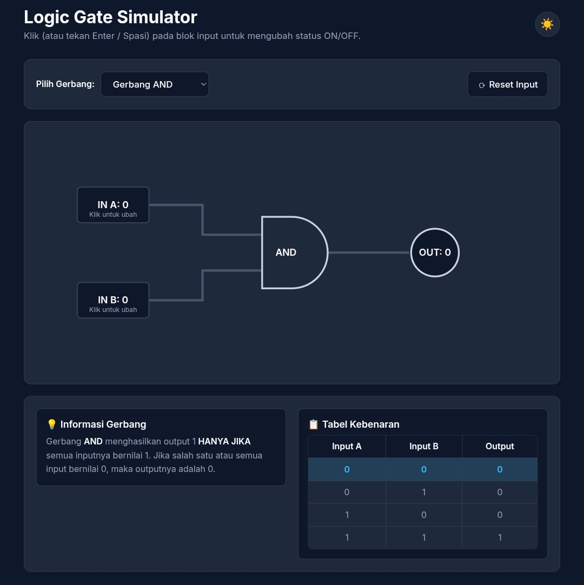

# 🔌 Logic Gate Simulator

Sebuah aplikasi web interaktif dan minimalis untuk memvisualisasikan dan mensimulasikan cara kerja gerbang logika (Logic Gates). Proyek ini dirancang khusus untuk membantu mahasiswa IT pemula dan siswa yang sedang mempelajari mata kuliah Sistem Digital.

🌐 **[Coba Live Demo Disini](https://aldoprawiroa.github.io/logic-gate-simulator/)**

## ✨ Fitur Utama
- **Simulasi Komprehensif:** Mendukung gerbang dasar (AND, OR, NOT) dan lanjutan (NAND, NOR, XOR, XNOR).
- **Interaktif & Real-time:** Klik pada input untuk mengubah nilai (0/1), dan saksikan perubahan output serta aliran listrik secara langsung.
- **Visualisasi Aliran Listrik:** Animasi jalur kabel yang menyala (ON) dan mati (OFF) membantu memahami konsep arsitektur sirkuit.
- **Tabel Kebenaran Otomatis:** Dilengkapi *Truth Table* yang ter-highlight secara otomatis sesuai dengan kombinasi input yang sedang berjalan.
- **Dark/Light Mode:** Dukungan tema gelap dan terang secara native (menyimpan preferensi pengguna).

## 🛠️ Teknologi yang Digunakan
- **HTML5:** Struktur semantik dan Canvas/SVG untuk visualisasi sirkuit.
- **CSS3:** Styling dengan pendekatan *Minimalist Flat Design*, transisi, dan animasi *keyframes* tanpa framework tambahan.
- **Vanilla JavaScript:** Manipulasi DOM dan logika kalkulasi gerbang secara murni.

## 🚀 Cara Penggunaan
1. Buka aplikasi melalui link Live Demo.
2. Gunakan **Dropdown Menu** untuk memilih jenis gerbang logika yang ingin dipelajari.
3. Klik pada kotak **IN A** atau **IN B** untuk mengubah status sinyal (0 untuk OFF, 1 untuk ON).
4. Perhatikan animasi aliran listrik pada kabel dan status lampu Output (menyala kuning jika 1).
5. Baca penjelasan singkat dan amati Tabel Kebenaran di bagian bawah untuk memperdalam pemahaman.

## 🎯 Target Pengguna & Nilai Edukasi
Aplikasi ini ditujukan bagi **Mahasiswa Sistem Informasi, Teknik Informatika, Ilmu Komputer**, atau siapa saja yang baru belajar dasar elektronika digital. Nilai edukasi utamanya adalah mengubah teori abstrak gerbang logika dan tabel kebenaran menjadi visualisasi yang nyata, interaktif, dan mudah diuji coba.

---
**Created by [aldoprawiroa](https://github.com/aldoprawiroa)**
